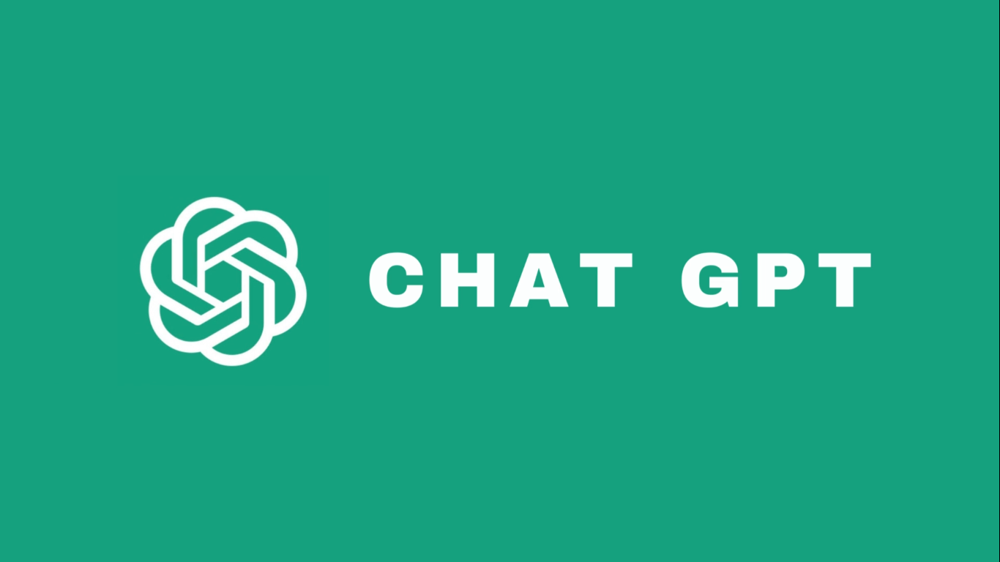

# Have you ever wanted to create a meaningful card for someone with a click of a button?

<div align="center">

🦜️🔗 LangChain
📉 Whisper


<br><br>

</div>

<p align="center">
  
</p> <br>
So have I! 

### This tool comprises: <br>
1. **Video stitcher**: Stitches all recorded videos into a single video. This can be used for data pre-processing or used to stitch a compilation as a gift.
2. **Automatic speech recognition**: Using OpenAI's whisper model, we transcribe the meaningful messages into text for the LLM to do its work.
3. **Generative AI**: Using langchain, we call the LLM (ChatGPT/HuggingFace models/other langchain supported LLMs) to do something funny - like write out an entire dating profile of your friend in html using the video transcript from Whisper. This can then be given as a gift to your friend as well
<br>
This tool was tested using my personal repository of video montages from friends appreciating other friends.

### Running the tool
```
git clone https://github.com/tituslhy/VideoMaker
pip -r requirements.txt
python3 main.py --root {folder_with_videos} --star {name_of_friend} --LLM {OpenAI/HuggingFace}
```
Of the arguments in the terminal run string, only the LLM setting is optional and defaults to None. In this instance, nothing is returned aside from the stitched video and the txt file. This is for users that prefer to craft more deliberate prompts and/or do not have a paid OpenAI account but wish to use ChatGPT for free on OpenAI's website.

### LLMs used:
1. ChatGPT - if the OpenAI setting is selected
2. Falcon - this is the default model if the HuggingFace setting is selected.
3. Google/FlanT5-base - this is the backup model if the HuggingFace setting is selected. Falcon has a limited number of API calls.